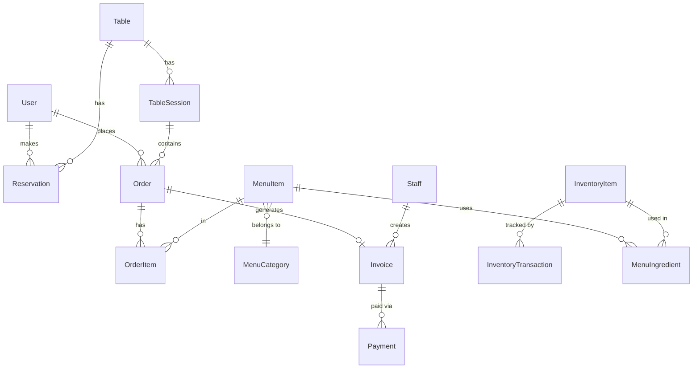

# Database Schema — Hệ thống quản lý nhà hàng

> MySQL 8 + Prisma ORM
> Cập nhật: 2026-05-24

---

## ERD Tổng quan (Mermaid)



---

## Chi tiết từng bảng

### 1. users — Tài khoản khách hàng
```sql
CREATE TABLE users (
  id          INT UNSIGNED AUTO_INCREMENT PRIMARY KEY,
  name        VARCHAR(100) NOT NULL,
  email       VARCHAR(150) UNIQUE,
  phone       VARCHAR(20) UNIQUE,
  password    VARCHAR(255) NOT NULL,
  avatar_url  VARCHAR(500),
  is_active   BOOLEAN DEFAULT TRUE,
  created_at  DATETIME DEFAULT CURRENT_TIMESTAMP,
  updated_at  DATETIME ON UPDATE CURRENT_TIMESTAMP
);
```
**Notes:** email hoặc phone bắt buộc có ít nhất một (enforce ở application layer)

---

### 2. staff — Tài khoản nhân viên
```sql
CREATE TABLE staff (
  id          INT UNSIGNED AUTO_INCREMENT PRIMARY KEY,
  name        VARCHAR(100) NOT NULL,
  email       VARCHAR(150) UNIQUE NOT NULL,
  phone       VARCHAR(20),
  password    VARCHAR(255) NOT NULL,
  role        ENUM('manager', 'receptionist', 'warehouse') NOT NULL,
  is_active   BOOLEAN DEFAULT TRUE,
  created_at  DATETIME DEFAULT CURRENT_TIMESTAMP,
  updated_at  DATETIME ON UPDATE CURRENT_TIMESTAMP
);
```
**Notes:** Chỉ manager tạo được staff mới. Role manager có full access.

---

### 3. tables — Bàn nhà hàng
```sql
CREATE TABLE tables (
  id          INT UNSIGNED AUTO_INCREMENT PRIMARY KEY,
  table_number VARCHAR(10) NOT NULL UNIQUE,  -- "A1", "B2", "VIP1"
  capacity    INT UNSIGNED NOT NULL,          -- số người tối đa
  location    VARCHAR(100),                   -- "Tầng 1", "Ngoài trời", "VIP"
  status      ENUM('available', 'reserved', 'occupied', 'cleaning') DEFAULT 'available',
  qr_code_url VARCHAR(500),                   -- URL ảnh QR đã generate
  notes       TEXT,
  is_active   BOOLEAN DEFAULT TRUE,
  created_at  DATETIME DEFAULT CURRENT_TIMESTAMP
);
```

---

### 4. reservations — Đặt bàn
```sql
CREATE TABLE reservations (
  id              INT UNSIGNED AUTO_INCREMENT PRIMARY KEY,
  user_id         INT UNSIGNED NOT NULL,
  table_id        INT UNSIGNED NOT NULL,
  reserved_date   DATE NOT NULL,
  reserved_time   TIME NOT NULL,
  guest_count     INT UNSIGNED NOT NULL,
  status          ENUM('pending', 'confirmed', 'cancelled', 'completed') DEFAULT 'pending',
  confirmed_by    INT UNSIGNED,               -- staff.id của tiếp tân xác nhận
  customer_note   TEXT,
  staff_note      TEXT,
  created_at      DATETIME DEFAULT CURRENT_TIMESTAMP,
  updated_at      DATETIME ON UPDATE CURRENT_TIMESTAMP,

  FOREIGN KEY (user_id)       REFERENCES users(id),
  FOREIGN KEY (table_id)      REFERENCES tables(id),
  FOREIGN KEY (confirmed_by)  REFERENCES staff(id),
  INDEX idx_date_time (reserved_date, reserved_time),
  INDEX idx_user (user_id),
  INDEX idx_status (status)
);
```

---

### 5. table_sessions — Phiên ngồi bàn thực tế
```sql
CREATE TABLE table_sessions (
  id              INT UNSIGNED AUTO_INCREMENT PRIMARY KEY,
  table_id        INT UNSIGNED NOT NULL,
  reservation_id  INT UNSIGNED,               -- NULL nếu walk-in qua QR
  opened_by       INT UNSIGNED,               -- staff.id, NULL nếu khách tự quét QR
  opened_at       DATETIME DEFAULT CURRENT_TIMESTAMP,
  closed_at       DATETIME,
  status          ENUM('open', 'closed') DEFAULT 'open',

  FOREIGN KEY (table_id)      REFERENCES tables(id),
  FOREIGN KEY (reservation_id) REFERENCES reservations(id),
  FOREIGN KEY (opened_by)     REFERENCES staff(id),
  INDEX idx_table_status (table_id, status)
);
```
**Notes:** Một bàn chỉ có một session `open` tại một thời điểm. Enforce ở application layer.

---

### 6. menu_categories — Danh mục thực đơn
```sql
CREATE TABLE menu_categories (
  id          INT UNSIGNED AUTO_INCREMENT PRIMARY KEY,
  name        VARCHAR(100) NOT NULL,          -- "Khai vị", "Món chính", "Đồ uống"
  sort_order  INT DEFAULT 0,
  is_active   BOOLEAN DEFAULT TRUE
);
```

---

### 7. menu_items — Món ăn
```sql
CREATE TABLE menu_items (
  id              INT UNSIGNED AUTO_INCREMENT PRIMARY KEY,
  category_id     INT UNSIGNED NOT NULL,
  name            VARCHAR(150) NOT NULL,
  description     TEXT,
  price           DECIMAL(10,2) UNSIGNED NOT NULL,
  image_url       VARCHAR(500),
  status          ENUM('available', 'unavailable') DEFAULT 'available',
  sort_order      INT DEFAULT 0,
  created_at      DATETIME DEFAULT CURRENT_TIMESTAMP,
  updated_at      DATETIME ON UPDATE CURRENT_TIMESTAMP,

  FOREIGN KEY (category_id) REFERENCES menu_categories(id),
  INDEX idx_category (category_id),
  INDEX idx_status (status)
);
```

---

### 8. orders — Đơn gọi món
```sql
CREATE TABLE orders (
  id              INT UNSIGNED AUTO_INCREMENT PRIMARY KEY,
  session_id      INT UNSIGNED NOT NULL,
  user_id         INT UNSIGNED,               -- NULL nếu không đăng nhập
  status          ENUM('pending', 'confirmed', 'preparing', 'served', 'cancelled') DEFAULT 'pending',
  confirmed_by    INT UNSIGNED,               -- staff.id tiếp tân xác nhận
  note            TEXT,
  created_at      DATETIME DEFAULT CURRENT_TIMESTAMP,
  updated_at      DATETIME ON UPDATE CURRENT_TIMESTAMP,

  FOREIGN KEY (session_id)    REFERENCES table_sessions(id),
  FOREIGN KEY (user_id)       REFERENCES users(id),
  FOREIGN KEY (confirmed_by)  REFERENCES staff(id),
  INDEX idx_session (session_id),
  INDEX idx_status (status)
);
```

---

### 9. order_items — Chi tiết từng món trong order
```sql
CREATE TABLE order_items (
  id              INT UNSIGNED AUTO_INCREMENT PRIMARY KEY,
  order_id        INT UNSIGNED NOT NULL,
  menu_item_id    INT UNSIGNED NOT NULL,
  quantity        INT UNSIGNED NOT NULL DEFAULT 1,
  unit_price      DECIMAL(10,2) UNSIGNED NOT NULL,  -- giá tại thời điểm order
  note            VARCHAR(255),                       -- "ít cay", "không hành"

  FOREIGN KEY (order_id)      REFERENCES orders(id),
  FOREIGN KEY (menu_item_id)  REFERENCES menu_items(id)
);
```
**Notes:** `unit_price` lưu giá tại thời điểm order để tránh ảnh hưởng khi giá menu thay đổi sau này.

---

### 10. invoices — Hoá đơn
```sql
CREATE TABLE invoices (
  id              INT UNSIGNED AUTO_INCREMENT PRIMARY KEY,
  session_id      INT UNSIGNED NOT NULL UNIQUE,
  created_by      INT UNSIGNED NOT NULL,      -- staff.id tiếp tân tạo
  subtotal        DECIMAL(10,2) UNSIGNED NOT NULL,
  discount_pct    DECIMAL(5,2) DEFAULT 0,     -- % giảm giá (0-100)
  discount_amount DECIMAL(10,2) DEFAULT 0,
  total           DECIMAL(10,2) UNSIGNED NOT NULL,
  status          ENUM('unpaid', 'paid', 'cancelled') DEFAULT 'unpaid',
  notes           TEXT,
  created_at      DATETIME DEFAULT CURRENT_TIMESTAMP,
  paid_at         DATETIME,

  FOREIGN KEY (session_id)  REFERENCES table_sessions(id),
  FOREIGN KEY (created_by)  REFERENCES staff(id)
);
```

---

### 11. payments — Thanh toán
```sql
CREATE TABLE payments (
  id                  INT UNSIGNED AUTO_INCREMENT PRIMARY KEY,
  invoice_id          INT UNSIGNED NOT NULL,
  method              ENUM('cash', 'vnpay', 'momo') NOT NULL,
  amount              DECIMAL(10,2) UNSIGNED NOT NULL,
  status              ENUM('pending', 'success', 'failed') DEFAULT 'pending',
  transaction_id      VARCHAR(100),           -- ID từ VNPay/Momo
  gateway_response    JSON,                   -- raw response từ payment gateway
  created_at          DATETIME DEFAULT CURRENT_TIMESTAMP,
  updated_at          DATETIME ON UPDATE CURRENT_TIMESTAMP,

  FOREIGN KEY (invoice_id) REFERENCES invoices(id),
  INDEX idx_transaction (transaction_id)
);
```

---

### 12. inventory_items — Nguyên liệu / hàng hoá kho
```sql
CREATE TABLE inventory_items (
  id              INT UNSIGNED AUTO_INCREMENT PRIMARY KEY,
  name            VARCHAR(150) NOT NULL,
  unit            VARCHAR(30) NOT NULL,       -- "kg", "lít", "cái", "chai"
  item_type       ENUM('ingredient', 'product') NOT NULL,
                                              -- ingredient: nguyên liệu nấu
                                              -- product: đồ uống đóng chai bán thẳng
  current_qty     DECIMAL(10,3) DEFAULT 0,
  min_qty         DECIMAL(10,3) DEFAULT 0,    -- ngưỡng cảnh báo
  notes           TEXT,
  is_active       BOOLEAN DEFAULT TRUE,
  created_at      DATETIME DEFAULT CURRENT_TIMESTAMP,
  updated_at      DATETIME ON UPDATE CURRENT_TIMESTAMP,

  INDEX idx_type (item_type),
  INDEX idx_low_stock (current_qty, min_qty)
);
```

---

### 13. inventory_transactions — Lịch sử nhập/xuất kho
```sql
CREATE TABLE inventory_transactions (
  id              INT UNSIGNED AUTO_INCREMENT PRIMARY KEY,
  item_id         INT UNSIGNED NOT NULL,
  type            ENUM('in', 'out', 'adjustment') NOT NULL,
  quantity        DECIMAL(10,3) NOT NULL,     -- dương = nhập, âm = xuất
  qty_before      DECIMAL(10,3) NOT NULL,     -- tồn kho trước giao dịch
  qty_after       DECIMAL(10,3) NOT NULL,     -- tồn kho sau giao dịch
  supplier        VARCHAR(150),               -- nhà cung cấp (khi nhập)
  unit_cost       DECIMAL(10,2),              -- giá nhập/đơn vị
  reference_id    INT UNSIGNED,               -- order_id nếu xuất theo order
  note            TEXT,
  created_by      INT UNSIGNED NOT NULL,      -- staff.id
  created_at      DATETIME DEFAULT CURRENT_TIMESTAMP,

  FOREIGN KEY (item_id)     REFERENCES inventory_items(id),
  FOREIGN KEY (created_by)  REFERENCES staff(id),
  INDEX idx_item (item_id),
  INDEX idx_date (created_at)
);
```

---

### 14. menu_ingredients — Công thức món ăn (Phase 2)
```sql
CREATE TABLE menu_ingredients (
  id              INT UNSIGNED AUTO_INCREMENT PRIMARY KEY,
  menu_item_id    INT UNSIGNED NOT NULL,
  inventory_id    INT UNSIGNED NOT NULL,
  qty_per_portion DECIMAL(10,3) NOT NULL,     -- lượng nguyên liệu cho 1 phần

  FOREIGN KEY (menu_item_id)  REFERENCES menu_items(id),
  FOREIGN KEY (inventory_id)  REFERENCES inventory_items(id),
  UNIQUE KEY uq_item_ingredient (menu_item_id, inventory_id)
);
```
**Notes:** Bảng này tạo sẵn nhưng Phase 1 chưa dùng đến. Phase 2 sẽ dùng để tự động trừ kho.

---

## Tóm tắt relationships

| Quan hệ | Loại |
|---|---|
| user → reservations | 1-N |
| table → reservations | 1-N |
| reservation → table_session | 1-1 (optional) |
| table_session → orders | 1-N |
| order → order_items | 1-N |
| menu_item → order_items | 1-N |
| table_session → invoice | 1-1 |
| invoice → payments | 1-N |
| inventory_item → transactions | 1-N |
| menu_item → menu_ingredients | 1-N (Phase 2) |

---

## Indexes quan trọng cần có

```sql
-- Tìm bàn trống theo ngày giờ
INDEX ON reservations (reserved_date, reserved_time, status)

-- Dashboard doanh thu
INDEX ON invoices (status, created_at)
INDEX ON payments (status, created_at)

-- Cảnh báo kho thấp
INDEX ON inventory_items (current_qty, min_qty)

-- Order theo session
INDEX ON orders (session_id, status)

-- Top món bán chạy
INDEX ON order_items (menu_item_id)
```
