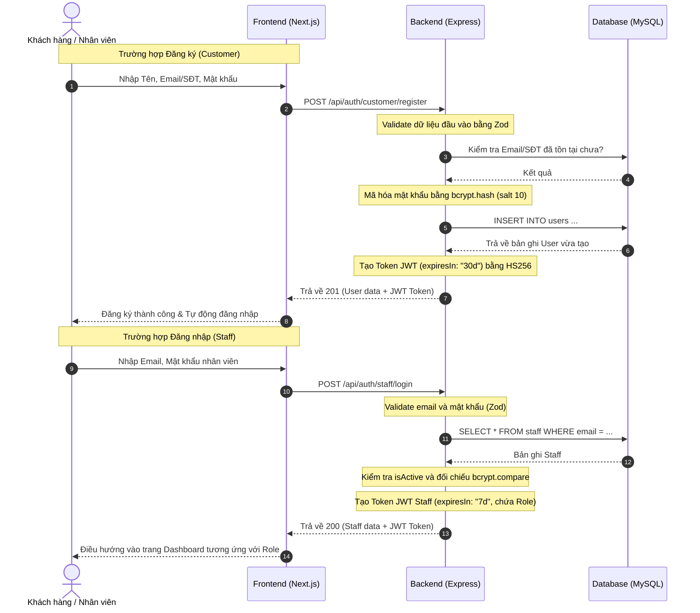
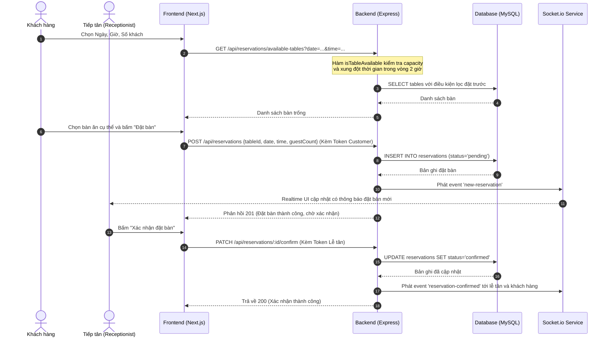
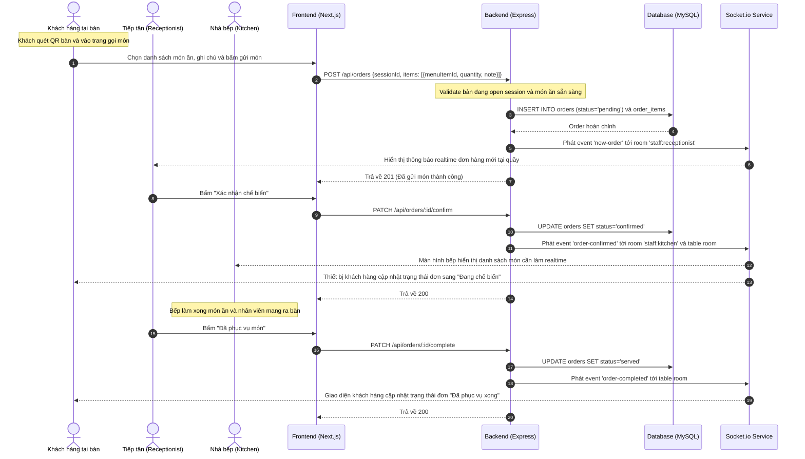
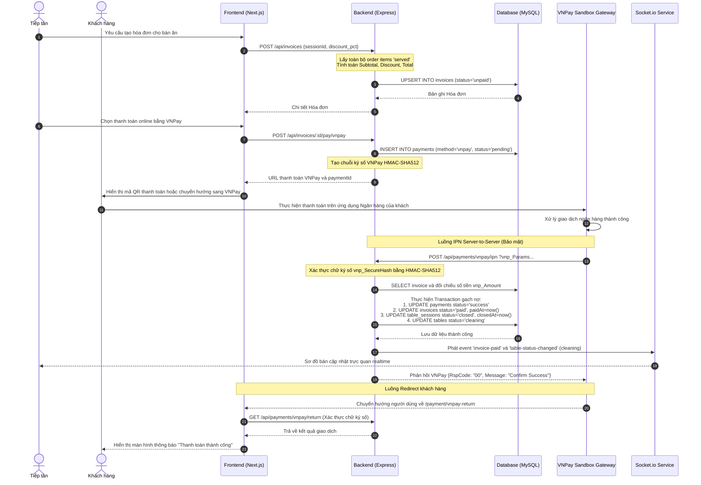
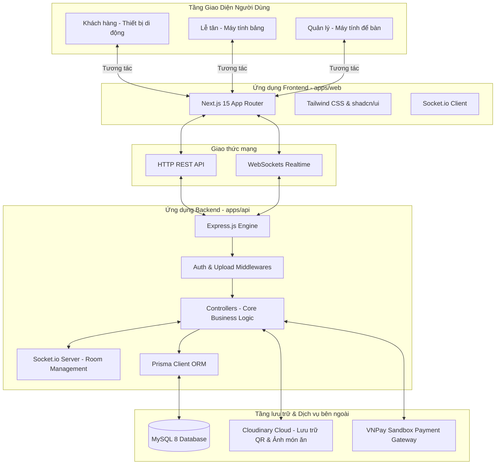

# TÀI LIỆU PHÂN TÍCH HỆ THỐNG (SYSTEM ANALYSIS)
## HỆ THỐNG QUẢN LÝ NHÀ HÀNG - ĐẶT BÀN & GỌI MÓN TRỰC TUYẾN

> **Chức danh tài liệu:** Hệ Thống Quản Lý Nhà Hàng (Restaurant Management System - Monorepo)  
> **Phiên bản:** 1.0 (MVP)  
> **Người thực hiện:** Senior Software Architect, Business Analyst & Technical Writer  
> **Ngày cập nhật:** 2026-06-11  

---

## 1. TỔNG QUAN HỆ THỐNG

### 1.1 Tên dự án
**Restaurant Management System (Restaurant_TS)** - Hệ thống quản lý nhà hàng tích hợp, vận hành theo mô hình gọi món trực tuyến tại bàn qua mã QR code, kết hợp đặt bàn online và quản lý kho hàng.

### 1.2 Mục tiêu dự án
*   **Số hóa vận hành:** Loại bỏ ghi chép thủ công bằng giấy tờ, tự động hóa quy trình đặt bàn (Reservation), gọi món (Ordering), quản lý bếp (Kitchen) và thanh toán (Payment).
*   **Nâng cao trải nghiệm khách hàng:** Cho phép khách hàng tự đặt bàn trước trực tuyến hoặc tự phục vụ xem thực đơn sinh động và gọi món ngay tại bàn bằng cách quét mã QR bằng thiết bị cá nhân.
*   **Tối ưu hóa quản lý kho:** Hỗ trợ thủ kho theo dõi chính xác lượng tồn kho nguyên vật liệu và sản phẩm, đưa ra cảnh báo kịp thời khi kho xuống dưới mức tối thiểu.
*   **Báo cáo tài chính trực quan:** Giúp chủ nhà hàng (Manager) theo dõi doanh thu thực tế theo ngày/tuần/tháng thông qua các biểu đồ phân tích trực quan.

### 1.3 Đối tượng sử dụng (Actors)
1.  **Khách hàng (Customer):** Sử dụng thiết bị di động để đăng ký, đăng nhập đặt bàn trước trực tuyến, hoặc quét mã QR tại bàn để xem thực đơn và gọi món mà không cần thông qua nhân viên phục vụ.
2.  **Tiếp tân (Receptionist):** Sử dụng Tablet/Desktop tại quầy lễ tân để quản lý danh sách đặt bàn, phê duyệt/hủy đặt bàn, mở/đóng phiên hoạt động của bàn ăn, xác nhận món ăn khách gửi yêu cầu, in hóa đơn và xử lý thanh toán.
3.  **Nhân viên kho (Warehouse Staff):** Sử dụng Desktop để thực hiện các giao dịch nhập/xuất kho vật lý, điều chỉnh số lượng tồn kho và giám sát ngưỡng cảnh báo hết hàng.
4.  **Quản lý / Chủ nhà hàng (Manager):** Có toàn quyền hạn tối cao trong hệ thống, quản lý tài khoản nhân sự, CRUD thông tin bàn ăn, danh mục thực đơn, món ăn, điều chỉnh trực tiếp số lượng tồn kho của các mặt hàng và xem báo cáo doanh thu tài chính.

---

## 2. PHÂN TÍCH NGHIỆP VỤ (BUSINESS PROCESSES)

### Nghiệp vụ 1: Đặt bàn trực tuyến trước (Online Reservation)
*   **Mô tả:** Khách hàng đã có tài khoản lựa chọn thời gian và số lượng khách để kiểm tra các bàn trống phù hợp và gửi yêu cầu đặt bàn trước cho nhà hàng.
*   **Actor tham gia:** Khách hàng (Customer), Tiếp tân (Receptionist).
*   **Input:** Ngày đặt bàn, giờ đặt bàn, số lượng khách, ghi chú của khách (tùy chọn).
*   **Output:** Một bản ghi đặt bàn (Reservation) ở trạng thái `pending` được tạo ra trong DB và gửi thông báo realtime tới Tiếp tân.
*   **Điều kiện trước (Pre-conditions):** Khách hàng đã đăng nhập tài khoản Customer thành công.
*   **Điều kiện sau (Post-conditions):** Bản ghi đặt bàn được lưu trữ và chờ Tiếp tân phê duyệt.
*   **Luồng xử lý chính:**
    1.  Khách hàng chọn Ngày, Giờ và Số lượng khách trên giao diện.
    2.  Hệ thống lọc các bàn còn trống (Capacity >= Số khách và không trùng thời gian đặt bàn khác).
    3.  Khách hàng chọn một bàn ưng ý, nhập ghi chú và gửi yêu cầu.
    4.  Hệ thống tạo bản ghi reservation với trạng thái `pending`.
    5.  Hệ thống gửi thông báo realtime event `new-reservation` qua Socket.io tới quầy Tiếp tân.
*   **Luồng ngoại lệ:**
    *   *Không có bàn nào trống thỏa mãn:* Hệ thống thông báo không có bàn phù hợp và đề nghị khách hàng thay đổi thời gian hoặc số khách.
    *   *Bàn bị trùng đặt trước trong lúc chọn:* Hệ thống báo lỗi "Bàn không còn khả dụng cho khung giờ này" và yêu cầu chọn bàn khác.

---

### Nghiệp vụ 2: Mở phiên bàn ăn (Table Session) qua QR Code
*   **Mô tả:** Khi khách hàng đến nhà hàng và ngồi vào bàn ăn, họ quét mã QR dán tại bàn để kích hoạt phiên làm việc tại bàn ăn đó, cho phép gọi món trực tiếp.
*   **Actor tham gia:** Khách hàng (Customer), Tiếp tân (Receptionist).
*   **Input:** Mã định danh của bàn (`tableId`), thông tin ID đặt bàn (`reservationId` - nếu có).
*   **Output:** Một phiên bàn ăn (`TableSession`) mới có trạng thái `open` được tạo ra, trạng thái bàn (`Table.status`) chuyển sang `occupied`.
*   **Điều kiện trước:** Bàn ăn đang ở trạng thái `available` hoặc `reserved` (nếu khách đã đặt bàn trước và check-in).
*   **Điều kiện sau:** Khách hàng được chuyển hướng đến trang Thực đơn của bàn đó để gọi món.
*   **Luồng xử lý chính:**
    1.  Khách hàng quét mã QR tại bàn, trình duyệt mở URL `/table/{tableId}`.
    2.  Hệ thống gửi request kiểm tra thông tin bàn:
        *   Nếu bàn đang `available`: Hệ thống tự động tạo một `TableSession` mới với trạng thái `open`. Trạng thái của bàn chuyển thành `occupied` trong DB.
        *   Nếu bàn đang `reserved` và khách có mã đặt bàn trùng khớp: Hệ thống tạo `TableSession` liên kết với `reservationId`, chuyển bàn sang `occupied`.
    3.  Hệ thống phát thông báo realtime `table-status-changed` tới lễ tân để cập nhật sơ đồ bàn.
    4.  Màn hình khách hàng chuyển sang giao diện chọn món ăn.
*   **Luồng ngoại lệ:**
    *   *Bàn đang ở trạng thái `occupied` (đang có khách ngồi):* Hệ thống trả về giao diện thực đơn của phiên hiện tại để khách đi cùng bàn có thể gọi thêm món chung.
    *   *Bàn đang ở trạng thái `cleaning` (đang dọn dẹp):* Hệ thống hiển thị thông báo "Bàn đang được dọn dẹp, vui lòng đợi lễ tân sắp xếp".

---

### Nghiệp vụ 3: Gọi món tại bàn và xử lý món ăn (Ordering & Kitchen Process)
*   **Mô tả:** Khách hàng chọn món từ thực đơn trên điện thoại và gửi yêu cầu gọi món. Tiếp tân duyệt món ăn và chuyển tiếp cho nhà bếp chế biến.
*   **Actor tham gia:** Khách hàng, Tiếp tân, Nhà bếp.
*   **Input:** Danh sách món ăn kèm số lượng (`menuItemId`, `quantity`, `note`).
*   **Output:** Bản ghi `Order` và `OrderItem` được tạo với trạng thái `pending`, sau đó cập nhật qua `confirmed` và cuối cùng là `served` khi hoàn thành chế biến.
*   **Điều kiện trước:** Bàn ăn đã được mở phiên hoạt động (`TableSession` ở trạng thái `open`).
*   **Điều kiện sau:** Món ăn được phục vụ lên bàn, doanh số món ăn được cập nhật.
*   **Luồng xử lý chính:**
    1.  Khách hàng thêm các món ăn từ thực đơn vào giỏ hàng, nhập ghi chú (nếu có) và nhấn "Gửi món".
    2.  Hệ thống tạo bản ghi `Order` ở trạng thái `pending`, liên kết với `TableSession` hiện tại.
    3.  Hệ thống gửi thông báo realtime event `new-order` đến Tiếp tân qua Socket.io.
    4.  Tiếp tân kiểm tra thông tin đơn hàng và bấm "Xác nhận". Trạng thái đơn chuyển sang `confirmed`.
    5.  Hệ thống gửi thông báo realtime event `order-confirmed` đến màn hình của Nhà bếp để bắt đầu chế biến, đồng thời gửi về thiết bị của Khách hàng tại bàn để theo dõi trạng thái.
    6.  Nhà bếp chế biến xong và chuyển món cho nhân viên chạy bàn. Tiếp tân cập nhật trạng thái đơn hàng thành `served` (hoàn thành phục vụ).
    7.  Hệ thống gửi thông báo realtime event `order-completed` tới phòng ăn của bàn để khách biết món ăn đã được phục vụ đầy đủ.
*   **Luồng ngoại lệ:**
    *   *Khách hàng gọi món đã hết (trạng thái `unavailable` trong DB):* Hệ thống chặn ngay từ giỏ hàng và không cho phép gửi đơn.
    *   *Đơn hàng bị Tiếp tân hủy:* Tiếp tân cập nhật trạng thái thành `cancelled` (ví dụ do hết nguyên liệu đột xuất), hệ thống gửi thông báo realtime `order-cancelled` về thiết bị khách hàng kèm lý do.

---

### Nghiệp vụ 4: Thanh toán hóa đơn (Invoicing & Payment)
*   **Mô tả:** Khách hàng yêu cầu thanh toán. Tiếp tân lập hóa đơn tổng hợp các món ăn đã phục vụ (`served`) của phiên đó, áp dụng giảm giá (nếu có) và thực hiện thu tiền mặt hoặc thanh toán trực tuyến qua cổng VNPay.
*   **Actor tham gia:** Tiếp tân, Khách hàng, Cổng thanh toán VNPay.
*   **Input:** ID phiên bàn ăn (`sessionId`), phần trăm giảm giá (`discount_pct` - tùy chọn), phương thức thanh toán (`cash` hoặc `vnpay`).
*   **Output:** Hóa đơn (`Invoice`) chuyển trạng thái từ `unpaid` thành `paid`. Phiên bàn ăn đóng (`closed`). Trạng thái bàn ăn chuyển sang `cleaning`.
*   **Điều kiện trước:** Phiên bàn ăn đang `open` và có ít nhất một đơn gọi món ở trạng thái `served`.
*   **Điều kiện sau:** Bàn ăn trống, sẵn sàng dọn dẹp để đón lượt khách tiếp theo.
*   **Luồng xử lý chính (Thanh toán online qua VNPay):**
    1.  Tiếp tân bấm tạo hóa đơn cho bàn ăn từ các món đã phục vụ. Hệ thống tính tiền: `Subtotal` -> `Discount` -> `Total`.
    2.  Tiếp tân chọn phương thức thanh toán "VNPay" và bấm tạo yêu cầu.
    3.  Hệ thống tạo một bản ghi `Payment` ở trạng thái `pending`, đồng thời sinh ra một URL thanh toán VNPay độc nhất (có kèm chữ ký bảo mật mã hóa HMAC-SHA512).
    4.  Khách hàng quét mã QR thanh toán trên màn hình hoặc Tiếp tân thực hiện hướng dẫn khách thanh toán.
    5.  Khách hàng thực hiện thanh toán trên ứng dụng Ngân hàng. Sau khi thành công, VNPay gửi kết quả phản hồi realtime về server thông qua Return URL và IPN callback.
    6.  Hệ thống xác thực chữ ký số của VNPay. Nếu thành công:
        *   Cập nhật `Payment` thành `success`.
        *   Cập nhật `Invoice` thành `paid` và lưu thời gian `paidAt`.
        *   Đóng phiên hoạt động `TableSession` sang `closed` (lưu `closedAt`).
        *   Chuyển trạng thái bàn ăn `Table.status` sang `cleaning`.
    7.  Hệ thống phát thông báo realtime `invoice-paid` và `table-status-changed` đến quầy lễ tân.
*   **Luồng ngoại lệ:**
    *   *Thanh toán thất bại hoặc khách hủy giao dịch:* Trạng thái `Payment` cập nhật thành `failed`. Hóa đơn vẫn giữ trạng thái `unpaid`, phiên bàn ăn tiếp tục mở để khách hàng thanh toán lại hoặc chọn phương thức khác.

---

### Nghiệp vụ 5: Quản lý kho hàng (Inventory Management)
*   **Mô tả:** Nhân viên kho ghi nhận việc nhập kho vật lý từ nhà cung cấp hoặc xuất kho, điều chỉnh số lượng tồn kho của nguyên vật liệu và sản phẩm.
*   **Actor tham gia:** Nhân viên kho (Warehouse Staff), Quản lý (Manager).
*   **Input:** ID mặt hàng kho (`itemId`), số lượng giao dịch, đơn giá nhập, nhà cung cấp, ghi chú.
*   **Output:** Số lượng tồn kho hiện tại (`currentQty`) của mặt hàng được cập nhật tương ứng. Ghi nhận lịch sử giao dịch vào bảng `InventoryTransaction`.
*   **Điều kiện trước:** Mặt hàng đã tồn tại trong danh mục quản lý kho.
*   **Điều kiện sau:** Số lượng tồn kho được điều chỉnh chính xác. Cảnh báo kho thấp xuất hiện nếu số lượng nhỏ hơn ngưỡng tối thiểu.
*   **Luồng xử lý chính:**
    1.  Nhân viên kho chọn chức năng "Nhập kho" hoặc "Xuất kho" trên hệ thống.
    2.  Nhập thông tin số lượng, đơn giá, nhà cung cấp và lý do.
    3.  Hệ thống cập nhật số lượng tồn kho `currentQty` của `InventoryItem` trong DB.
    4.  Hệ thống ghi lại lịch sử vào bảng `InventoryTransaction` có liên kết với tài khoản nhân viên thực hiện giao dịch đó.
    5.  Hệ thống tự động kiểm tra xem `currentQty` có nhỏ hơn hoặc bằng `minQty` (ngưỡng tối thiểu) hay không. Nếu có, mặt hàng đó được đánh dấu thuộc danh sách cảnh báo "Low Stock".
*   **Luồng ngoại lệ:**
    *   *Số lượng xuất kho lớn hơn số lượng hiện có:* Hệ thống chặn giao dịch và báo lỗi: "Số lượng tồn kho không đủ để xuất" (Mã lỗi: `INSUFFICIENT_STOCK`).
    *   *Chức năng Điều chỉnh tồn kho về một số lượng chính xác (Adjust):* Chỉ có Quản lý (Manager) mới có quyền thực hiện. Nhân viên kho thông thường không thể gọi API này.

---

## 3. CHỨC NĂNG HỆ THỐNG THEO MODULE (SYSTEM MODULES)

Dưới đây là sơ đồ phân rã chức năng hệ thống theo Module, chỉ rõ các file code và API endpoints liên quan trong mã nguồn:

### 3.1 Module Phân quyền & Authentication (Auth & Staff Management)
*   **Các chức năng:**
    *   Đăng ký tài khoản Khách hàng (Customer Register)
    *   Đăng nhập tài khoản Khách hàng (Customer Login)
    *   Đăng nhập tài khoản Nhân viên (Staff Login)
    *   Xem thông tin tài khoản hiện tại (Get Staff Profile)
    *   Quản lý danh sách nhân sự (Get Staff List, Create Staff, Update Staff Profile/Role/Status)
*   **File liên quan:**
    *   Backend: [auth.routes.ts](file:///c:/Users/Admin/VSCode-workspace/Restaurant_TS/apps/api/src/routes/auth.routes.ts), [auth.controller.ts](file:///c:/Users/Admin/VSCode-workspace/Restaurant_TS/apps/api/src/controllers/auth.controller.ts)
    *   Frontend: [apps/web/app/login/page.tsx](file:///c:/Users/Admin/VSCode-workspace/Restaurant_TS/apps/web/app/login/page.tsx), [apps/web/app/(auth)/customer](file:///c:/Users/Admin/VSCode-workspace/Restaurant_TS/apps/web/app/(auth)/customer), [apps/web/app/(auth)/staff](file:///c:/Users/Admin/VSCode-workspace/Restaurant_TS/apps/web/app/(auth)/staff), [apps/web/app/(staff)/manager/staff/page.tsx](file:///c:/Users/Admin/VSCode-workspace/Restaurant_TS/apps/web/app/(staff)/manager/staff/page.tsx)
*   **API liên quan:**
    *   `POST /api/auth/staff/login`
    *   `GET /api/auth/staff/me`
    *   `GET /api/auth/staff` (Manager Only)
    *   `POST /api/auth/staff` (Manager Only)
    *   `PATCH /api/auth/staff/:id` (Manager Only)
    *   `POST /api/auth/customer/register`
    *   `POST /api/auth/customer/login`

### 3.2 Module Quản lý Bàn ăn (Table Management)
*   **Các chức năng:**
    *   Xem danh sách sơ đồ bàn ăn kèm trạng thái realtime (Available, Reserved, Occupied, Cleaning)
    *   Tạo bàn ăn mới, cập nhật thông tin bàn ăn (Sức chứa, vị trí, ghi chú)
    *   Xóa bàn ăn (Soft Delete - ẩn bàn ăn)
    *   Tự động phát sinh mã QR cho từng bàn ăn và upload lên Cloudinary
*   **File liên quan:**
    *   Backend: [table.routes.ts](file:///c:/Users/Admin/VSCode-workspace/Restaurant_TS/apps/api/src/routes/table.routes.ts), [table.controller.ts](file:///c:/Users/Admin/VSCode-workspace/Restaurant_TS/apps/api/src/controllers/table.controller.ts)
    *   Frontend: [apps/web/app/(staff)/manager/tables](file:///c:/Users/Admin/VSCode-workspace/Restaurant_TS/apps/web/app/(staff)/manager/tables), [apps/web/app/(staff)/receptionist/tables](file:///c:/Users/Admin/VSCode-workspace/Restaurant_TS/apps/web/app/(staff)/receptionist/tables)
*   **API liên quan:**
    *   `GET /api/tables`
    *   `GET /api/tables/:id`
    *   `POST /api/tables` (Manager Only)
    *   `PATCH /api/tables/:id` (Manager & Receptionist)
    *   `DELETE /api/tables/:id` (Manager Only)
    *   `POST /api/tables/:id/generate-qr` (Manager Only)

### 3.3 Module Đặt bàn (Reservation Management)
*   **Các chức năng:**
    *   Kiểm tra và tìm kiếm bàn trống theo ngày, giờ, số người dùng thực tế
    *   Khách hàng đặt bàn trực tuyến trước (Tạo reservation ở trạng thái `pending`)
    *   Xem danh sách lịch sử đặt bàn của Khách hàng hiện tại
    *   Tiếp tân xem toàn bộ danh sách đặt bàn toàn hệ thống có bộ lọc
    *   Xác nhận đặt bàn (Confirm Reservation - chuyển sang `confirmed`)
    *   Hủy đặt bàn (Cancel Reservation - chuyển sang `cancelled` kèm lý do)
*   **File liên quan:**
    *   Backend: [reservation.routes.ts](file:///c:/Users/Admin/VSCode-workspace/Restaurant_TS/apps/api/src/routes/reservation.routes.ts), [reservation.controller.ts](file:///c:/Users/Admin/VSCode-workspace/Restaurant_TS/apps/api/src/controllers/reservation.controller.ts)
    *   Frontend: [apps/web/app/customer/reservations/page.tsx](file:///c:/Users/Admin/VSCode-workspace/Restaurant_TS/apps/web/app/customer/reservations/page.tsx), [apps/web/app/(staff)/receptionist/reservations](file:///c:/Users/Admin/VSCode-workspace/Restaurant_TS/apps/web/app/(staff)/receptionist/reservations)
*   **API liên quan:**
    *   `GET /api/reservations/available-tables`
    *   `POST /api/reservations` (Customer Only)
    *   `GET /api/reservations/my` (Customer Only)
    *   `GET /api/reservations` (Receptionist & Manager)
    *   `PATCH /api/reservations/:id/confirm` (Receptionist & Manager)
    *   `PATCH /api/reservations/:id/cancel` (Customer sở hữu hoặc Staff)

### 3.4 Module Thực đơn & Gọi món (Menu & Order Management)
*   **Các chức năng:**
    *   Xem thực đơn công khai (Public Menu - phân chia theo danh mục món ăn)
    *   Quản lý danh mục món ăn (Tạo mới, sửa tên/thứ tự hiển thị, xóa danh mục)
    *   Quản lý món ăn (Tạo mới, sửa giá/ảnh/mô tả, soft delete món ăn, toggle trạng thái có hàng/hết hàng)
    *   Khách hàng gọi món tại bàn ăn qua QR code (Tạo order `pending`)
    *   Xem danh sách các đơn gọi món của phiên bàn ăn hiện tại
    *   Tiếp tân xác nhận đơn gọi món (Confirm order -> `confirmed`)
    *   Nhà bếp chế biến xong (Served order -> `served`)
    *   Hủy đơn gọi món (Cancel order -> `cancelled`)
*   **File liên quan:**
    *   Backend: [menu.routes.ts](file:///c:/Users/Admin/VSCode-workspace/Restaurant_TS/apps/api/src/routes/menu.routes.ts), [menu.controller.ts](file:///c:/Users/Admin/VSCode-workspace/Restaurant_TS/apps/api/src/controllers/menu.controller.ts), [order.routes.ts](file:///c:/Users/Admin/VSCode-workspace/Restaurant_TS/apps/api/src/routes/order.routes.ts), [order.controller.ts](file:///c:/Users/Admin/VSCode-workspace/Restaurant_TS/apps/api/src/controllers/order.controller.ts)
    *   Frontend: [apps/web/app/table/[tableId]/menu/page.tsx](file:///c:/Users/Admin/VSCode-workspace/Restaurant_TS/apps/web/app/table/%5BtableId%5D/menu/page.tsx), [apps/web/app/(staff)/manager/menu](file:///c:/Users/Admin/VSCode-workspace/Restaurant_TS/apps/web/app/(staff)/manager/menu), [apps/web/app/(staff)/receptionist/orders](file:///c:/Users/Admin/VSCode-workspace/Restaurant_TS/apps/web/app/(staff)/receptionist/orders)
*   **API liên quan:**
    *   `GET /api/menu` (Public)
    *   `GET /api/menu/categories`
    *   `POST /api/menu/categories` (Manager Only)
    *   `PATCH /api/menu/categories/:id` (Manager Only)
    *   `DELETE /api/menu/categories/:id` (Manager Only)
    *   `GET /api/menu/items`
    *   `POST /api/menu/items` (Manager Only - Upload ảnh qua Cloudinary)
    *   `PATCH /api/menu/items/:id` (Manager Only)
    *   `DELETE /api/menu/items/:id` (Manager Only)
    *   `PATCH /api/menu/items/:id/toggle` (Manager Only)
    *   `POST /api/orders` (Public/Customer tại bàn)
    *   `GET /api/orders/:sessionId` (Staff & Customer tại bàn)
    *   `PATCH /api/orders/:id/confirm` (Receptionist Only)
    *   `PATCH /api/orders/:id/complete` (Receptionist Only)
    *   `PATCH /api/orders/:id/cancel` (Receptionist Only)

### 3.5 Module Hóa đơn & Thanh toán (Invoice & Payment Management)
*   **Các chức năng:**
    *   Tạo hóa đơn tạm tính từ các món ăn đã được phục vụ (`served`) trong phiên bàn ăn hiện tại
    *   Xem chi tiết hóa đơn hiện tại của bàn ăn
    *   Thanh toán tiền mặt trực tiếp (Đóng phiên bàn ăn và đổi trạng thái bàn thành `cleaning`)
    *   Thanh toán trực tuyến (Tạo liên kết thanh toán VNPay)
    *   Nhận kết quả redirect và IPN callback từ VNPay để tự động hóa việc gạch nợ hóa đơn và đóng bàn ăn
*   **File liên quan:**
    *   Backend: [invoice.routes.ts](file:///c:/Users/Admin/VSCode-workspace/Restaurant_TS/apps/api/src/routes/invoice.routes.ts), [invoice.controller.ts](file:///c:/Users/Admin/VSCode-workspace/Restaurant_TS/apps/api/src/controllers/invoice.controller.ts), [vnpay.service.ts](file:///c:/Users/Admin/VSCode-workspace/Restaurant_TS/apps/api/src/services/vnpay.service.ts)
    *   Frontend: [apps/web/app/payment/success](file:///c:/Users/Admin/VSCode-workspace/Restaurant_TS/apps/web/app/payment/success), [apps/web/app/payment/failed](file:///c:/Users/Admin/VSCode-workspace/Restaurant_TS/apps/web/app/payment/failed), [apps/web/app/payment/vnpay-return](file:///c:/Users/Admin/VSCode-workspace/Restaurant_TS/apps/web/app/payment/vnpay-return), [apps/web/app/(staff)/receptionist/invoices](file:///c:/Users/Admin/VSCode-workspace/Restaurant_TS/apps/web/app/(staff)/receptionist/invoices)
*   **API liên quan:**
    *   `POST /api/invoices` (Receptionist & Manager)
    *   `GET /api/invoices/:id`
    *   `GET /api/invoices/sessions/:sessionId/invoice`
    *   `POST /api/invoices/:id/pay/cash` (Receptionist & Manager)
    *   `POST /api/invoices/:id/pay/vnpay` (Receptionist & Manager)
    *   `GET /api/payments/vnpay/return` (Public - VNPay Callback redirect)
    *   `POST /api/payments/vnpay/ipn` (Public - VNPay Callback Server-to-Server)

### 3.6 Module Quản lý Kho hàng (Inventory Management)
*   **Các chức năng:**
    *   Xem danh sách các nguyên vật liệu/sản phẩm kho có sẵn
    *   Lọc danh sách các mặt hàng sắp hết kho dưới ngưỡng tối thiểu (Low Stock Warning)
    *   Tạo mặt hàng mới trong kho hàng
    *   Cập nhật thông tin chi tiết mặt hàng
    *   Nhập kho nguyên vật liệu (Ghi nhận nhà cung cấp, chi phí, cập nhật số lượng tăng)
    *   Xuất kho nguyên vật liệu (Cập nhật số lượng giảm, kiểm tra tính khả dụng của số lượng xuất)
    *   Điều chỉnh trực tiếp số lượng tồn kho (Chỉ có quyền Manager)
    *   Truy vấn lịch sử các giao dịch nhập/xuất kho kèm bộ lọc thời gian
*   **File liên quan:**
    *   Backend: [inventory.routes.ts](file:///c:/Users/Admin/VSCode-workspace/Restaurant_TS/apps/api/src/routes/inventory.routes.ts), [inventory.controller.ts](file:///c:/Users/Admin/VSCode-workspace/Restaurant_TS/apps/api/src/controllers/inventory.controller.ts)
    *   Frontend: [apps/web/app/(staff)/warehouse/inventory](file:///c:/Users/Admin/VSCode-workspace/Restaurant_TS/apps/web/app/(staff)/warehouse/inventory)
*   **API liên quan:**
    *   `GET /api/inventory` (Warehouse & Manager)
    *   `GET /api/inventory/low-stock` (Warehouse & Manager)
    *   `POST /api/inventory` (Warehouse & Manager)
    *   `PATCH /api/inventory/:id` (Warehouse & Manager)
    *   `POST /api/inventory/:id/add-stock` (Warehouse & Manager)
    *   `POST /api/inventory/:id/remove-stock` (Warehouse & Manager)
    *   `POST /api/inventory/:id/adjust` (Manager Only)
    *   `GET /api/inventory/transactions` (Warehouse & Manager)

### 3.7 Module Thống kê Doanh thu & Kho (Stats Management)
*   **Các chức năng:**
    *   Xem báo cáo tổng hợp doanh thu, số đơn đã phục vụ, số bàn đã tiếp đón theo ngày/tuần/tháng
    *   Dữ liệu biểu đồ doanh thu 30 ngày gần nhất
    *   Danh sách 10 món ăn bán chạy nhất theo số lượng và doanh thu (trong khoảng thời gian tùy chọn)
    *   Xem tổng quan báo cáo nhập xuất kho và các mặt hàng nhập/xuất nhiều nhất
*   **File liên quan:**
    *   Backend: [stats.routes.ts](file:///c:/Users/Admin/VSCode-workspace/Restaurant_TS/apps/api/src/routes/stats.routes.ts), [stats.controller.ts](file:///c:/Users/Admin/VSCode-workspace/Restaurant_TS/apps/api/src/controllers/stats.controller.ts)
    *   Frontend: [apps/web/app/(staff)/manager/dashboard](file:///c:/Users/Admin/VSCode-workspace/Restaurant_TS/apps/web/app/(staff)/manager/dashboard), [apps/web/app/(staff)/manager/statistics](file:///c:/Users/Admin/VSCode-workspace/Restaurant_TS/apps/web/app/(staff)/manager/statistics)
*   **API liên quan:**
    *   `GET /api/stats/revenue` (Manager Only)
    *   `GET /api/stats/revenue-chart` (Manager Only)
    *   `GET /api/stats/top-items` (Manager Only)
    *   `GET /api/stats/inventory` (Manager Only)
    *   `GET /api/stats/inventory-chart` (Manager Only)

---

## 4. LUỒNG XỬ LÝ CHI TIẾT (WORKFLOWS)

### 4.1 Quy trình Đăng nhập / Đăng ký (Staff & Customer Auth)


### 4.2 Quy trình Đặt bàn online & Check-in


### 4.3 Quy trình Gọi món tại bàn (Ordering Flow)


### 4.4 Quy trình Thanh toán hóa đơn qua cổng VNPay


---

## 5. DATABASE ANALYSIS (MÔ TẢ CƠ SỞ DỮ LIỆU)

Hệ thống sử dụng cơ sở dữ liệu quan hệ **MySQL 8** được quản lý thông qua **Prisma ORM**. Các bảng dữ liệu được chuẩn hóa cao độ để đảm bảo tính toàn vẹn dữ liệu.

### 5.1 Sơ đồ mối quan hệ thực thể (ERD)
```mermaid
erDiagram
    users {
        unsigned_int id PK
        varchar_100 name
        varchar_150 email UK
        varchar_20 phone UK
        varchar_255 password
        varchar_500 avatar_url
        boolean is_active
        datetime created_at
        datetime updated_at
    }
    staff {
        unsigned_int id PK
        varchar_100 name
        varchar_150 email UK
        varchar_20 phone
        varchar_255 password
        StaffRole role
        boolean is_active
        datetime created_at
        datetime updated_at
    }
    tables {
        unsigned_int id PK
        varchar_10 table_number UK
        unsigned_int capacity
        varchar_100 location
        TableStatus status
        longtext qr_code_url
        text notes
        boolean is_active
        datetime created_at
    }
    reservations {
        unsigned_int id PK
        unsigned_int user_id FK
        unsigned_int table_id FK
        date reserved_date
        time reserved_time
        unsigned_int guest_count
        ReservationStatus status
        unsigned_int confirmed_by FK
        text customer_note
        text staff_note
        unsigned_int duration_minutes
        datetime no_show_at
        datetime created_at
        datetime updated_at
    }
    table_sessions {
        unsigned_int id PK
        unsigned_int table_id FK
        unsigned_int reservation_id FK
        unsigned_int opened_by FK
        datetime opened_at
        datetime closed_at
        TableSessionStatus status
    }
    menu_categories {
        unsigned_int id PK
        varchar_100 name
        int sort_order
        boolean is_active
    }
    menu_items {
        unsigned_int id PK
        unsigned_int category_id FK
        varchar_150 name
        text description
        decimal_10_2 price
        varchar_500 image_url
        MenuItemStatus status
        int sort_order
        datetime created_at
        datetime updated_at
    }
    orders {
        unsigned_int id PK
        unsigned_int session_id FK
        unsigned_int user_id FK
        OrderStatus status
        unsigned_int confirmed_by FK
        text note
        datetime created_at
        datetime updated_at
    }
    order_items {
        unsigned_int id PK
        unsigned_int order_id FK
        unsigned_int menu_item_id FK
        unsigned_int quantity
        decimal_10_2 unit_price
        varchar_255 note
    }
    invoices {
        unsigned_int id PK
        unsigned_int session_id FK UK
        unsigned_int created_by FK
        decimal_10_2 subtotal
        decimal_5_2 discount_pct
        decimal_10_2 discount_amount
        decimal_10_2 total
        InvoiceStatus status
        text notes
        datetime created_at
        datetime paid_at
    }
    payments {
        unsigned_int id PK
        unsigned_int invoice_id FK
        PaymentMethod method
        decimal_10_2 amount
        PaymentStatus status
        varchar_100 transaction_id
        json gateway_response
        datetime created_at
        datetime updated_at
    }
    inventory_items {
        unsigned_int id PK
        varchar_150 name
        varchar_30 unit
        InventoryItemType item_type
        decimal_10_3 current_qty
        decimal_10_3 min_qty
        text notes
        boolean is_active
        datetime created_at
        datetime updated_at
    }
    inventory_transactions {
        unsigned_int id PK
        unsigned_int item_id FK
        InventoryTransactionType type
        decimal_10_3 quantity
        decimal_10_3 qty_before
        decimal_10_3 qty_after
        varchar_150 supplier
        decimal_10_2 unit_cost
        unsigned_int reference_id
        text note
        unsigned_int created_by FK
        datetime created_at
    }
    menu_ingredients {
        unsigned_int id PK
        unsigned_int menu_item_id FK
        unsigned_int inventory_id FK
        decimal_10_3 qty_per_portion
    }

    users ||--o{ reservations : "makes"
    users ||--o{ orders : "places"
    tables ||--o{ reservations : "holds"
    tables ||--o{ table_sessions : "hosts"
    staff ||--o{ reservations : "confirms"
    staff ||--o{ orders : "confirms"
    staff ||--o{ table_sessions : "opens"
    staff ||--o{ invoices : "creates"
    staff ||--o{ inventory_transactions : "performs"
    reservations ||--o| table_sessions : "binds"
    table_sessions ||--o{ orders : "contains"
    table_sessions ||--o| invoices : "settles"
    menu_categories ||--o{ menu_items : "groups"
    menu_items ||--o{ order_items : "ordered"
    menu_items ||--o{ menu_ingredients : "needs"
    orders ||--o{ order_items : "has"
    invoices ||--o{ payments : "paid_by"
    inventory_items ||--o{ inventory_transactions : "changes"
    inventory_items ||--o{ menu_ingredients : "ingredient_of"
```

### 5.2 Mô tả thuộc tính chi tiết của các bảng chính
*(Một số bảng mô tả kiểu dữ liệu SQL tương ứng trong Prisma schema)*

#### 1. Bảng `users` (Khách hàng)
| Tên cột | Kiểu dữ liệu | Nullable | Khóa | Mô tả |
| :--- | :--- | :---: | :---: | :--- |
| `id` | INT UNSIGNED | NO | PK | ID tự tăng định danh khách hàng |
| `name` | VARCHAR(100) | NO | | Họ và tên khách hàng |
| `email` | VARCHAR(150) | YES | UK | Địa chỉ email của khách hàng |
| `phone` | VARCHAR(20) | YES | UK | Số điện thoại của khách hàng |
| `password` | VARCHAR(255) | NO | | Mật khẩu băm (bcrypt) |
| `avatar_url` | VARCHAR(500) | YES | | Đường dẫn ảnh đại diện |
| `is_active` | BOOLEAN | NO | | Trạng thái hoạt động (Default: true) |
| `created_at` | DATETIME | NO | | Thời gian tạo tài khoản |

#### 2. Bảng `staff` (Nhân viên)
| Tên cột | Kiểu dữ liệu | Nullable | Khóa | Mô tả |
| :--- | :--- | :---: | :---: | :--- |
| `id` | INT UNSIGNED | NO | PK | ID tự tăng của nhân viên |
| `name` | VARCHAR(100) | NO | | Họ và tên nhân viên |
| `email` | VARCHAR(150) | NO | UK | Email đăng nhập của nhân viên |
| `password` | VARCHAR(255) | NO | | Mật khẩu băm (bcrypt) |
| `role` | ENUM | NO | | Vai trò: `manager`, `receptionist`, `warehouse` |
| `is_active` | BOOLEAN | NO | | Trạng thái hoạt động (Default: true) |

#### 3. Bảng `tables` (Bàn ăn)
| Tên cột | Kiểu dữ liệu | Nullable | Khóa | Mô tả |
| :--- | :--- | :---: | :---: | :--- |
| `id` | INT UNSIGNED | NO | PK | ID bàn ăn |
| `table_number`| VARCHAR(10) | NO | UK | Tên/số bàn (Ví dụ: A01, VIP02) |
| `capacity` | INT UNSIGNED | NO | | Sức chứa tối đa (số người) |
| `location` | VARCHAR(100) | YES | | Vị trí (Tầng 1, Ban công, v.v.) |
| `status` | ENUM | NO | | Trạng thái: `available`, `reserved`, `occupied`, `cleaning` |
| `qr_code_url` | LONGTEXT | YES | | Đường dẫn lưu ảnh mã QR trên Cloudinary |

#### 4. Bảng `reservations` (Thông tin đặt bàn)
| Tên cột | Kiểu dữ liệu | Nullable | Khóa | Mô tả |
| :--- | :--- | :---: | :---: | :--- |
| `id` | INT UNSIGNED | NO | PK | ID đơn đặt bàn |
| `user_id` | INT UNSIGNED | NO | FK | Liên kết tới `users.id` |
| `table_id` | INT UNSIGNED | NO | FK | Liên kết tới `tables.id` |
| `reserved_date`| DATE | NO | | Ngày đặt bàn |
| `reserved_time`| TIME | NO | | Giờ đặt bàn |
| `status` | ENUM | NO | | Trạng thái: `pending`, `confirmed`, `cancelled`, `completed`, `no_show` |
| `confirmed_by`| INT UNSIGNED | YES | FK | ID lễ tân xác nhận (`staff.id`) |
| `duration_minutes`| INT UNSIGNED| NO | | Thời lượng giữ bàn dự kiến (Default: 120) |

#### 5. Bảng `table_sessions` (Phiên làm việc tại bàn)
| Tên cột | Kiểu dữ liệu | Nullable | Khóa | Mô tả |
| :--- | :--- | :---: | :---: | :--- |
| `id` | INT UNSIGNED | NO | PK | ID phiên hoạt động |
| `table_id` | INT UNSIGNED | NO | FK | Liên kết tới `tables.id` |
| `reservation_id`| INT UNSIGNED| YES | FK, UK| Liên kết tới `reservations.id` (nếu có) |
| `opened_by` | INT UNSIGNED | YES | FK | ID nhân viên mở session (`staff.id`) |
| `status` | ENUM | NO | | Trạng thái: `open`, `closed` |

#### 6. Bảng `invoices` (Hóa đơn)
| Tên cột | Kiểu dữ liệu | Nullable | Khóa | Mô tả |
| :--- | :--- | :---: | :---: | :--- |
| `id` | INT UNSIGNED | NO | PK | ID hóa đơn thanh toán |
| `session_id` | INT UNSIGNED | NO | FK, UK| Liên kết tới `table_sessions.id` |
| `created_by` | INT UNSIGNED | NO | FK | ID lễ tân lập hóa đơn (`staff.id`) |
| `subtotal` | DECIMAL(10,2)| NO | | Tổng tiền hàng tạm tính |
| `discount_pct` | DECIMAL(5,2) | NO | | % giảm giá (0 - 100%) |
| `discount_amount`| DECIMAL(10,2)| NO | | Số tiền được giảm giá thực tế |
| `total` | DECIMAL(10,2)| NO | | Tổng tiền khách cần thanh toán cuối cùng |
| `status` | ENUM | NO | | Trạng thái: `unpaid`, `paid`, `cancelled` |

---

## 6. API ANALYSIS (PHÂN TÍCH API CHI TIẾT)

Hệ thống được phát triển với bộ các RESTful API phân chia phân quyền chặt chẽ. Dưới đây là bảng tổng hợp tất cả các API endpoints chính của hệ thống.

### 6.1 Bảng tổng hợp API Endpoints

| Method | URL | Chức năng | Quyền truy cập (Auth) |
| :--- | :--- | :--- | :--- |
| **POST** | `/api/auth/staff/login` | Đăng nhập tài khoản nhân viên | Public |
| **GET** | `/api/auth/staff/me` | Lấy thông tin Staff đang đăng nhập | Token Staff (Mọi role) |
| **GET** | `/api/auth/staff` | Lấy danh sách toàn bộ nhân viên | Token Staff (Manager) |
| **POST** | `/api/auth/staff` | Tạo tài khoản nhân viên mới | Token Staff (Manager) |
| **PATCH**| `/api/auth/staff/:id` | Sửa thông tin/Kích hoạt nhân viên | Token Staff (Manager) |
| **POST** | `/api/auth/customer/register` | Đăng ký tài khoản khách hàng mới | Public |
| **POST** | `/api/auth/customer/login` | Đăng nhập tài khoản khách hàng | Public |
| **GET** | `/api/tables` | Xem danh sách bàn ăn & trạng thái | Token Staff (Mọi role) |
| **GET** | `/api/tables/:id` | Xem thông tin chi tiết một bàn ăn | Token Staff (Mọi role) |
| **POST** | `/api/tables` | Tạo bàn ăn mới trong nhà hàng | Token Staff (Manager) |
| **PATCH**| `/api/tables/:id` | Cập nhật thông tin bàn ăn | Token Staff (Manager, Receptionist) |
| **DELETE**| `/api/tables/:id` | Xóa bàn ăn (Soft Delete) | Token Staff (Manager) |
| **POST** | `/api/tables/:id/generate-qr`| Tạo mã QR cho bàn & upload Cloudinary | Token Staff (Manager) |
| **GET** | `/api/reservations/available-tables`| Lọc tìm bàn trống đặt trước | Public |
| **POST** | `/api/reservations` | Khách hàng đặt bàn trực tuyến | Token Customer |
| **GET** | `/api/reservations/my` | Khách xem lịch sử đặt bàn cá nhân | Token Customer |
| **GET** | `/api/reservations` | Tiếp tân xem toàn bộ danh sách đặt bàn | Token Staff (Receptionist, Manager) |
| **PATCH**| `/api/reservations/:id/confirm` | Xác nhận duyệt lịch đặt bàn của khách | Token Staff (Receptionist, Manager) |
| **PATCH**| `/api/reservations/:id/cancel` | Hủy đặt bàn (lý do hủy) | Token Customer/Staff hợp lệ |
| **GET** | `/api/tables/:tableId/session` | Lấy thông tin phiên bàn đang mở | Public (Khách tại bàn quét QR) |
| **POST** | `/api/tables/:tableId/session`| Mở phiên bàn ăn mới qua QR | Public (Khách tại bàn quét QR) |
| **PATCH**| `/api/sessions/:id/close` | Đóng phiên bàn ăn thủ công | Token Staff (Receptionist) |
| **GET** | `/api/menu` | Xem menu món sẵn có | Public |
| **GET** | `/api/menu/categories` | Lấy danh mục món ăn | Token Staff |
| **POST** | `/api/menu/categories` | Tạo danh mục món mới | Token Staff (Manager) |
| **PATCH**| `/api/menu/categories/:id`| Cập nhật danh mục món ăn | Token Staff (Manager) |
| **DELETE**| `/api/menu/categories/:id`| Xóa danh mục (Soft Delete) | Token Staff (Manager) |
| **GET** | `/api/menu/items` | Xem toàn bộ danh sách món ăn | Token Staff |
| **POST** | `/api/menu/items` | Tạo món ăn mới (Form-data + Image) | Token Staff (Manager) |
| **PATCH**| `/api/menu/items/:id` | Cập nhật thông tin/Ảnh món ăn | Token Staff (Manager) |
| **DELETE**| `/api/menu/items/:id` | Xóa món ăn (Soft Delete) | Token Staff (Manager) |
| **PATCH**| `/api/menu/items/:id/toggle`| Bật/tắt trạng thái hết hàng của món | Token Staff (Manager) |
| **POST** | `/api/orders` | Khách hàng tại bàn gọi món | Public |
| **GET** | `/api/orders/:sessionId` | Xem các món đã gọi của bàn ăn | Public / Staff / Customer |
| **PATCH**| `/api/orders/:id/confirm` | Tiếp tân duyệt món ăn gửi tới bếp | Token Staff (Receptionist) |
| **PATCH**| `/api/orders/:id/complete`| Lễ tân báo món đã được phục vụ lên bàn| Token Staff (Receptionist) |
| **PATCH**| `/api/orders/:id/cancel` | Hủy món khách đặt | Token Staff (Receptionist) |
| **POST** | `/api/invoices` | Lập hóa đơn thanh toán cho bàn | Token Staff (Receptionist, Manager) |
| **GET** | `/api/invoices/:id` | Xem chi tiết hóa đơn thanh toán | Token Staff |
| **GET** | `/api/invoices/sessions/:sessionId/invoice`| Xem hóa đơn của một phiên bàn | Token Staff |
| **POST** | `/api/invoices/:id/pay/cash`| Thanh toán hóa đơn bằng tiền mặt | Token Staff (Receptionist, Manager) |
| **POST** | `/api/invoices/:id/pay/vnpay`| Tạo link thanh toán VNPay | Token Staff (Receptionist, Manager) |
| **GET** | `/api/payments/vnpay/return`| Nhận phản hồi thanh toán của VNPay | Public |
| **POST** | `/api/payments/vnpay/ipn`| IPN Callback Server-to-Server VNPay | Public |
| **GET** | `/api/inventory` | Xem danh sách vật tư kho | Token Staff (Warehouse, Manager) |
| **GET** | `/api/inventory/low-stock`| Xem danh sách vật tư sắp hết | Token Staff (Warehouse, Manager) |
| **POST** | `/api/inventory` | Khai báo mặt hàng mới trong kho | Token Staff (Warehouse, Manager) |
| **PATCH**| `/api/inventory/:id` | Sửa đổi thông tin mặt hàng kho | Token Staff (Warehouse, Manager) |
| **POST** | `/api/inventory/:id/add-stock`| Nhập hàng vào kho vật lý | Token Staff (Warehouse, Manager) |
| **POST** | `/api/inventory/:id/remove-stock`| Xuất hàng ra khỏi kho vật lý | Token Staff (Warehouse, Manager) |
| **POST** | `/api/inventory/:id/adjust`| Điều chỉnh trực tiếp số lượng tồn | Token Staff (Manager Only) |
| **GET** | `/api/inventory/transactions`| Truy vấn lịch sử nhập xuất kho | Token Staff (Warehouse, Manager) |
| **GET** | `/api/stats/revenue` | Báo cáo doanh thu tài chính tổng hợp | Token Staff (Manager) |
| **GET** | `/api/stats/revenue-chart`| Lấy số liệu biểu đồ doanh thu | Token Staff (Manager) |
| **GET** | `/api/stats/top-items` | Thống kê món ăn bán chạy nhất | Token Staff (Manager) |
| **GET** | `/api/stats/inventory` | Báo cáo kho hàng tổng hợp | Token Staff (Manager) |
| **GET** | `/api/stats/inventory-chart`| Số liệu biểu đồ giao dịch kho | Token Staff (Manager) |

---

## 7. BUSINESS RULES (QUY TẮC NGHIỆP VỤ)

Quy tắc nghiệp vụ cốt lõi được cấu hình trực tiếp trong logic code backend:

1.  **Phân quyền truy cập độc quyền theo vai trò (Role Isolation):**
    *   Chỉ tài khoản `Manager` mới có quyền quản trị nhân sự, CRUD món ăn/danh mục, tạo mã QR, điều chỉnh số lượng tồn kho (Adjust Stock) và truy cập toàn bộ báo cáo doanh thu tài chính (`stats`).
    *   Chỉ `Receptionist` mới có quyền xác nhận món ăn gửi bếp (`confirmOrder`, `completeOrder`, `cancelOrder`) và đóng phiên bàn ăn (`closeSession`).
    *   Chỉ `Warehouse` và `Manager` mới được phép thao tác trên API `/api/inventory`. Nhân viên lễ tân không thể truy cập tài liệu kho hàng.
2.  **Khử trùng lặp Đặt bàn (Reservation Conflicting Check):**
    *   Bàn chỉ được coi là trống cho một lịch đặt bàn mới nếu bàn đó đang ở trạng thái kích hoạt hoạt động (`isActive = true`), có sức chứa đủ số người (`capacity >= guestCount`), và không tồn tại bất cứ lịch đặt bàn nào khác ở trạng thái `pending` hoặc `confirmed` bị trùng thời gian trong khoảng cửa sổ an toàn 2 tiếng (trước và sau giờ đặt dự kiến).
3.  **Tự động cập nhật trạng thái bàn bằng Scheduler ngầm (Cron Job):**
    *   Chạy định kỳ mỗi **5 phút** một lần.
    *   *Rule 1:* Tìm tất cả đặt bàn có trạng thái `confirmed` có thời gian đặt bàn trong vòng 30 phút tới. Nếu bàn ăn đang ở trạng thái `available`, hệ thống tự động đổi trạng thái bàn sang `reserved` để giữ chỗ cho khách.
    *   *Rule 2:* Tìm tất cả đặt bàn đã quá giờ đặt bàn 2 tiếng (`120 phút`) mà khách hàng chưa check-in (chưa mở `TableSession`). Hệ thống tự động chuyển trạng thái đặt bàn đó thành `no_show`, đồng thời giải phóng bàn ăn chuyển từ trạng thái `reserved` về `available` để đón khách khác.
4.  **Kiểm soát Gọi món tại bàn:**
    *   Chỉ cho phép tạo đơn gọi món (`Order`) khi phiên bàn ăn `TableSession` tương ứng đang hoạt động (`status = 'open'`). Khách hàng không thể gọi món nếu bàn đã đóng phiên hoặc tiếp tân đang lập hóa đơn.
    *   Món ăn được gọi phải có trạng thái sẵn sàng phục vụ (`status = 'available'`).
5.  **Nguyên tắc lập Hóa đơn:**
    *   Một hóa đơn thanh toán chỉ tổng hợp giá trị từ những món ăn đã phục vụ thành công tới khách hàng (đơn gọi món có trạng thái `status = 'served'`).
    *   Các món ăn đang chờ làm (`pending`) hoặc đang làm (`confirmed`) bắt buộc phải được xử lý hoàn tất hoặc hủy trước khi có thể tính tiền lập hóa đơn.
6.  **Xử lý Kho vật lý và Cảnh báo hết hàng:**
    *   Không cho phép xuất kho (`remove-stock`) với số lượng vượt quá lượng tồn kho hiện tại (`currentQty`) trong kho để tránh âm kho vật lý.
    *   Khi cập nhật kho, nếu số lượng tồn kho của mặt hàng `currentQty <= minQty` (ngưỡng tối thiểu được Manager thiết lập), hệ thống tự động đưa mặt hàng đó vào danh sách cảnh báo tồn kho thấp.
    *   Phase 1 (MVP) không tự động trừ kho theo công thức cấu thành món ăn (Non-goals). Mọi thao tác xuất nhập kho phải được thực hiện bằng tay bởi thủ kho dựa trên thực tế sử dụng.

---

## 8. VALIDATION RULES (QUY TẮC KIỂM TRA DỮ LIỆU)

Hệ thống sử dụng thư viện **Zod** tại tầng Controller để đảm bảo tính hợp lệ của dữ liệu đầu vào trước khi truy vấn xuống Database. Dưới đây là các schema kiểm tra dữ liệu chính:

### 8.1 Module Auth & Nhân viên
*   **`staffLoginSchema`** (Vị trí: [auth.controller.ts:L12-L15](file:///c:/Users/Admin/VSCode-workspace/Restaurant_TS/apps/api/src/controllers/auth.controller.ts#L12-L15))
    *   `email`: Phải là chuỗi định dạng Email hợp lệ (`z.string().email()`).
    *   `password`: Chuỗi có độ dài tối thiểu 6 ký tự (`z.string().min(6)`).
*   **`customerRegisterSchema`** (Vị trí: [auth.controller.ts:L21-L39](file:///c:/Users/Admin/VSCode-workspace/Restaurant_TS/apps/api/src/controllers/auth.controller.ts#L21-L39))
    *   `name`: Chuỗi không được để trống (`z.string().min(1)`).
    *   `email`: Email tùy chọn (`optional`).
    *   `phone`: Số điện thoại tùy chọn, tối thiểu 10 chữ số nếu nhập.
    *   `password`: Tối thiểu 6 ký tự.
    *   *Ràng buộc tùy chỉnh (refine):* Bắt buộc phải có ít nhất một trong hai thông tin `email` hoặc `phone`.
*   **`createStaffSchema`** (Vị trí: [auth.controller.ts:L389-L395](file:///c:/Users/Admin/VSCode-workspace/Restaurant_TS/apps/api/src/controllers/auth.controller.ts#L389-L395))
    *   `name`: Độ dài 1 - 100 ký tự.
    *   `email`: Định dạng email, tối đa 150 ký tự.
    *   `phone`: Tối đa 20 ký tự (tùy chọn).
    *   `password`: Tối thiểu 6 ký tự.
    *   `role`: Bắt buộc là một trong 3 giá trị ENUM: `manager`, `receptionist`, `warehouse`.

### 8.2 Module Bàn ăn & Đặt bàn
*   **`createTableSchema`** (Vị trí: [table.controller.ts:L13-L18](file:///c:/Users/Admin/VSCode-workspace/Restaurant_TS/apps/api/src/controllers/table.controller.ts#L13-L18))
    *   `tableNumber`: Chuỗi ký tự bắt buộc, không trống.
    *   `capacity`: Số nguyên dương, tối thiểu là 1.
*   **`createReservationSchema`** (Vị trí: [reservation.controller.ts:L20-L26](file:///c:/Users/Admin/VSCode-workspace/Restaurant_TS/apps/api/src/controllers/reservation.controller.ts#L20-L26))
    *   `tableId`: Số nguyên dương.
    *   `date`: Chuỗi định dạng ngày hợp lệ (xác thực qua `Date.parse`).
    *   `time`: Chuỗi biểu diễn thời gian bắt buộc theo định dạng Regex `HH:mm` (Ví dụ: `19:30`).
    *   `guestCount`: Số nguyên dương lớn hơn 0.

### 8.3 Module Gọi món & Hóa đơn
*   **`orderItemSchema`** (Vị trí: [order.controller.ts:L14-L18](file:///c:/Users/Admin/VSCode-workspace/Restaurant_TS/apps/api/src/controllers/order.controller.ts#L14-L18))
    *   `menuItemId`: Số nguyên dương định danh món ăn.
    *   `quantity`: Số nguyên dương tối thiểu là 1.
    *   `note`: Chuỗi ký tự tùy chọn.
*   **`createOrderSchema`** (Vị trí: [order.controller.ts:L24-L27](file:///c:/Users/Admin/VSCode-workspace/Restaurant_TS/apps/api/src/controllers/order.controller.ts#L24-L27))
    *   `items`: Mảng chứa các đối tượng kiểm tra bởi `orderItemSchema`, bắt buộc có tối thiểu 1 item.
*   **`createInvoiceSchema`** (Vị trí: [invoice.controller.ts:L19-L21](file:///c:/Users/Admin/VSCode-workspace/Restaurant_TS/apps/api/src/controllers/invoice.controller.ts#L19-L21))
    *   `discount_pct`: Số thực nằm trong phạm vi từ `0` đến `100` (giảm giá tối đa 100%).

### 8.4 Module Kho hàng
*   **`createItemSchema`** (Vị trí: [inventory.controller.ts:L10-L24](file:///c:/Users/Admin/VSCode-workspace/Restaurant_TS/apps/api/src/controllers/inventory.controller.ts#L10-L24))
    *   `name`: Tên nguyên liệu/sản phẩm (1 - 150 ký tự).
    *   `unit`: Đơn vị tính (1 - 30 ký tự, ví dụ: "kg", "chai").
    *   `item_type`: Chỉ được là `'ingredient'` hoặc `'product'`.
    *   `min_qty`: Số thực không âm (>= 0), tự động chuyển đổi từ kiểu chuỗi nếu là form-data.
*   **`addStockSchema` / `removeStockSchema`** (Vị trí: [inventory.controller.ts:L38-L51](file:///c:/Users/Admin/VSCode-workspace/Restaurant_TS/apps/api/src/controllers/inventory.controller.ts#L38-L51))
    *   `quantity`: Số thực lớn hơn 0, tự động chuyển đổi từ chuỗi.
    *   `unit_cost`: Số thực không âm (đối với giao dịch nhập kho).

---

## 9. CÁC THUẬT TOÁN HỆ THỐNG (ALGORITHMS & LOGIC)

### 9.1 Thuật toán Kiểm tra tính khả dụng của bàn (Table Availability Check)
*   **Tên hàm:** `isTableAvailable` (Vị trí: [reservation.controller.ts:L51-L138](file:///c:/Users/Admin/VSCode-workspace/Restaurant_TS/apps/api/src/controllers/reservation.controller.ts#L51-L138))
*   **Mục đích:** Xác định xem một bàn ăn cụ thể có thể phục vụ cho một lịch đặt bàn/gọi món mới tại một mốc thời gian xác định hay không.
*   **Input:**
    *   `tableId`: ID bàn ăn cần kiểm tra.
    *   `reservedDateStr`: Chuỗi ngày đặt dạng `YYYY-MM-DD`.
    *   `reservedTimeStr`: Chuỗi giờ đặt dạng `HH:mm`.
    *   `guestCount`: Số lượng khách dự kiến ngồi.
    *   `durationHours`: Khung thời gian chiếm giữ bàn (Mặc định: 2 giờ).
*   **Output:** `true` nếu bàn trống hợp lệ, `false` nếu không khả dụng.
*   **Độ phức tạp thuật toán:**
    *   Thời gian: $O(N)$ với $N$ là số lượng lịch đặt trước cho bàn đó trong ngày đang xét.
    *   Không gian: $O(1)$ do chỉ lưu trữ biến mốc thời gian tạm thời.
*   **Pseudocode mô tả thuật toán:**
```text
FUNCTION isTableAvailable(tableId, dateStr, timeStr, guestCount, durationHours = 2)
    // 1. Kiểm tra sức chứa bàn ăn
    table = Database.FindTableById(tableId)
    IF table IS NULL OR table.isActive IS FALSE OR table.capacity < guestCount THEN
        RETURN FALSE
    ENDIF

    // 2. Thiết lập khoảng thời gian chiếm dụng dự kiến của khách
    requestedStart = ParseDateTime(dateStr + " " + timeStr)
    requestedEnd = requestedStart + (durationHours * 60 * 60 * 1000) // cộng số ms

    // 3. Quét toàn bộ các đặt bàn trùng ngày của bàn này
    conflictingReservations = Database.FindReservations(tableId, dateStr, statuses=["pending", "confirmed"])
    FOR EACH res IN conflictingReservations
        resStart = GetReservationStartDateTime(res)
        resEnd = resStart + (res.durationMinutes * 60 * 1000)

        // Kiểm tra chồng chéo khung giờ (Interval Overlap)
        // StartA < EndB và StartB < EndA
        IF requestedStart < resEnd AND resStart < requestedEnd THEN
            RETURN FALSE // Có xung đột giờ đặt
        ENDIF
    ENDFOR

    // 4. Kiểm tra xem có TableSession nào đang OPEN thực tế đè lên không
    openSession = Database.FindOpenSession(tableId)
    IF openSession IS NOT NULL THEN
        sessionStart = openSession.openedAt
        sessionEnd = sessionStart + (2 * 60 * 60 * 1000) // Giả định session giữ bàn 2 giờ
        IF requestedStart < sessionEnd AND sessionStart < requestedEnd THEN
            RETURN FALSE // Trùng với phiên khách đang ăn tại quán
        ENDIF
    ENDIF

    RETURN TRUE
ENDFUNCTION
```

---

### 9.2 Thuật toán Ký và Xác thực Chữ ký số VNPay (Secure Hash Algorithm)
*   **Tên hàm:** `createPaymentUrl` và `verifyReturnUrl` (Vị trí: [vnpay.service.ts](file:///c:/Users/Admin/VSCode-workspace/Restaurant_TS/apps/api/src/services/vnpay.service.ts))
*   **Mục đích:** Bảo vệ tính toàn vẹn của dữ liệu giao dịch gửi sang và nhận về từ cổng thanh toán VNPay, chống tấn công thay đổi số tiền hoặc giả mạo trạng thái thanh toán.
*   **Công thức & Cơ chế:**
    1.  **Sắp xếp tham số (Sorting):** Mọi tham số gửi đi (trừ chữ ký) được sắp xếp theo thứ tự bảng chữ cái của tên khóa (Key).
    2.  **Mã hóa URL (URL Encoding):** Các khóa và giá trị được mã hóa ký tự đặc biệt theo chuẩn VNPay (khoảng trắng chuyển đổi thành dấu `+` thay vì `%20`).
    3.  **Tạo chuỗi Sign Data:** Ghép các cặp `Key=Value` lại bằng dấu `&`.
    4.  **Băm mã hóa HMAC-SHA512:** Tạo chữ ký số bằng cách băm chuỗi Sign Data với khóa bí mật (`VNPAY_HASH_SECRET`) được cung cấp bởi VNPay.
*   **Pseudocode quy trình xác thực IPN Callback:**
```text
FUNCTION verifyIpn(queryParams)
    receivedSecureHash = queryParams["vnp_SecureHash"]
    
    // Tạo bản sao và xóa trường chứa hash để tính toán lại
    params = Clone(queryParams)
    DELETE params["vnp_SecureHash"]
    DELETE params["vnp_SecureHashType"]

    // Sắp xếp Alphabet theo Key
    sortedParams = SortAlphabeticalByKey(params)
    
    // Nối chuỗi định dạng key=value&key2=value2
    signData = BuildQueryStringWithoutDoubleEncoding(sortedParams)
    
    // Tính toán HMAC-SHA512 với Secret Key
    calculatedHash = HmacSHA512(signData, SecretKey)
    
    // So sánh chữ ký
    IF calculatedHash EQUALS receivedSecureHash THEN
        RETURN { isValid: TRUE, responseCode: queryParams["vnp_ResponseCode"], ... }
    ELSE
        RETURN { isValid: FALSE }
    ENDIF
ENDFUNCTION
```

---

## 10. AN NINH HỆ THỐNG (SECURITY ARCHITECTURE)

Hệ thống triển khai các biện pháp bảo mật nhiều lớp từ khâu mã hóa dữ liệu đến phân quyền API:

1.  **Bảo mật dữ liệu mật khẩu (Password Hashing):**
    *   Sử dụng thư viện `bcrypt` để băm mật khẩu của cả khách hàng (`User`) và nhân viên (`Staff`).
    *   Áp dụng độ muối băm `saltRounds = 10`, đảm bảo chống tấn công vét cạn (brute-force) và bảng cầu vồng (rainbow tables).
2.  **Cơ chế xác thực stateless qua JWT (JSON Web Token Authentication):**
    *   Hệ thống cấp phát 2 loại token độc lập thông qua giải thuật mã hóa đối xứng **HS256** với khóa bí mật `JWT_SECRET`:
        *   *Staff Token:* Mã hóa ID và Role (`manager`, `receptionist`, `warehouse`). Thời hạn hết hạn là **7 ngày** (`7d`).
        *   *Customer Token:* Mã hóa ID và trường cố định `role: "customer"`. Thời hạn hết hạn là **30 ngày** (`30d`).
    *   Token được truyền tải thông qua tiêu đề HTTP: `Authorization: Bearer <token>`.
3.  **Hệ thống phân quyền Role-Based Access Control (RBAC):**
    *   Triển khai thông qua bộ ba middleware trung gian tại backend:
        *   `verifyStaffToken`: Giải mã token, xác thực tài khoản Staff còn hoạt động (`isActive = true`), gắn dữ liệu vào `req.user`.
        *   `requireRole(allowedRoles)`: Kiểm tra `req.user.role` có nằm trong mảng quyền được phép truy cập hay không, nếu không trả về HTTP `403 Forbidden`.
        *   `verifyCustomerToken`: Giải mã token của khách hàng, gắn dữ liệu vào `req.customer`.
        *   `verifyTokenEither`: Cho phép chấp nhận cả Token khách hàng và nhân viên cho các API dùng chung (ví dụ: hủy đặt bàn).
4.  **Bảo mật cổng thanh toán (Payment Integrity):**
    *   Áp dụng thuật toán băm bảo mật HMAC-SHA512 để bảo mật liên kết VNPay.
    *   Đối chiếu trực tiếp số tiền nhận được từ VNPay callback (`vnp_Amount / 100`) với số tiền gốc lưu trong hóa đơn (`Invoice.total`) ở môi trường backend nhằm ngăn chặn gian lận chỉnh sửa giá trị hóa đơn (Tấn công thay đổi tham số Client-side).
    *   Kiểm tra tính duy nhất của ID giao dịch để chống tấn công Replay Attack.

---

## 11. KIẾN TRÚC HỆ THỐNG (SYSTEM ARCHITECTURE)

Dự án được thiết kế theo mô hình kiến trúc **Monorepo** phân chia rõ ràng phần Frontend và Backend trong cùng một kho lưu trữ mã nguồn, hỗ trợ quản lý phụ thuộc đồng bộ.

### 11.1 Sơ đồ kiến trúc tổng quan


### 11.2 Phân tích Kiến trúc Component Backend
Backend áp dụng kiến trúc phân tầng (Layered Architecture):
1.  **Routing Layer (`src/routes`)**: Định nghĩa các endpoint của API, ánh xạ HTTP Method với controller xử lý và tiêm các middleware bảo mật thích hợp (`verifyStaffToken`, `requireRole`, `uploadSingle`).
2.  **Controller Layer (`src/controllers`)**: Nơi thực thi logic nghiệp vụ chính. Tiếp nhận request, xác thực định dạng dữ liệu qua Zod schema, thao tác với database thông qua Prisma Client, phát các sự kiện realtime và trả về phản hồi JSON theo cấu trúc chuẩn: `{ success: true, data: ... }` hoặc `{ success: false, error: ... }`.
3.  **Data Access Layer (Prisma ORM)**: Giao tiếp trực tiếp với MySQL Database.

---

## 12. PHÂN TÍCH THƯ VIỆN & PHỤ THUỘC (DEPENDENCY ANALYSIS)

Hệ thống tận dụng các thư viện mã nguồn mở chất lượng cao để xây dựng sản phẩm ổn định và nhanh chóng:

### 12.1 Backend Dependencies (`apps/api/package.json`)
*   **`express`**: Framework cung cấp lõi định tuyến API gọn nhẹ, hiệu năng cao.
*   **`@prisma/client` & `prisma`**: Bộ công cụ ORM mạnh mẽ giúp truy vấn MySQL an toàn về kiểu dữ liệu (Type-safe), tự động đồng bộ hóa DB qua cơ chế migration.
*   **`socket.io`**: Thư viện quản lý kết nối WebSocket hai chiều, hỗ trợ phân chia Room (Staff room, Kitchen room, Table room) để đẩy thông báo realtime.
*   **`zod`**: Thư viện dùng để khai báo Schema Validation dữ liệu ở Runtime, giúp bắt lỗi đầu vào API tự động.
*   **`bcrypt`**: Thư viện băm bảo mật mật khẩu.
*   **`jsonwebtoken`**: Tạo và xác thực chữ ký JWT phục vụ cơ chế Stateless Session.
*   **`multer` & `multer-storage-cloudinary` & `cloudinary`**: Bộ công cụ tiếp nhận file gửi lên từ Form-data, tự động truyền tải và lưu trữ ảnh lên dịch vụ Cloudinary.
*   **`qrcode`**: Hỗ trợ sinh ma trận QR bàn ăn tự động dưới dạng ảnh Base64.
*   **`dotenv`**: Nạp các cấu hình bảo mật từ file `.env` vào môi trường hệ thống.

### 12.2 Frontend Dependencies (`apps/web/package.json`)
*   **`next` (Next.js 15)**: Framework React tối ưu hóa cho Production, sử dụng App Router hỗ trợ Server-Side Rendering (SSR) kết hợp Client-side interactivity.
*   **`tailwindcss` & `postcss`**: Framework phát triển CSS nhanh chóng, tạo giao diện responsive mượt mà.
*   **`lucide-react`**: Bộ icon hiện đại, tối giản.
*   **`socket.io-client`**: Kết nối và nhận sự kiện realtime từ Server Backend.

---

## 13. CẤU TRÚC THƯ MỤC DỰ ÁN (PROJECT STRUCTURE)

Cấu trúc thư mục Monorepo được tổ chức như sau:

```text
Restaurant_TS/
├── apps/
│   ├── api/                     # ── BỘ MÃ NGUỒN BACKEND (ExpressJS & Prisma)
│   │   ├── prisma/
│   │   │   ├── migrations/      # Các file lịch sử thay đổi cấu trúc DB SQL
│   │   │   ├── schema.prisma    # File thiết kế Database Schema chính
│   │   │   ├── seed.ts          # Script khởi tạo dữ liệu mẫu hệ thống
│   │   │   └── seed-stats.ts    # Script tạo dữ liệu báo cáo mẫu cho Manager
│   │   ├── src/
│   │   │   ├── controllers/     # Điều hướng logic nghiệp vụ (Auth, Inventory, Invoice, Menu, Order, Reservations, Tables...)
│   │   │   ├── middlewares/     # Middleware xác thực token, kiểm tra role, upload file
│   │   │   ├── routes/          # Khai báo các đường dẫn API tương ứng với Controller
│   │   │   ├── services/        # Dịch vụ tích hợp bên thứ ba (vnpay.service.ts)
│   │   │   ├── socket/          # Quản lý kết nối Socket.IO, phân chia Room realtime
│   │   │   ├── utils/           # Helper tiện ích (JWT, Cloudinary, Scheduler cron job...)
│   │   │   └── index.ts         # Điểm khởi chạy của máy chủ Express Server
│   │   ├── tsconfig.json
│   │   └── package.json
│   │
│   └── web/                     # ── BỘ MÃ NGUỒN FRONTEND (Next.js App Router)
│       ├── app/                 # Các trang giao diện chính (App Router)
│       │   ├── (auth)/          # Group routes cho đăng nhập (customer/staff)
│       │   ├── (staff)/         # Group routes cho nhân viên (manager, receptionist, warehouse)
│       │   │   ├── manager/     # Trang quản trị của Quản lý (Dashboard, Staff, Menu, Tables, Stats)
│       │   │   ├── receptionist/# Giao diện Tiếp tân (Đặt bàn, gọi món, lập hóa đơn)
│       │   │   └── warehouse/   # Giao diện Thủ kho (Danh mục kho, nhập xuất hàng, cảnh báo tồn)
│       │   ├── customer/        # Lịch sử đặt bàn của Khách hàng
│       │   ├── table/           # Trang hạ cánh quét QR tại bàn ăn
│       │   ├── payment/         # Xử lý phản hồi thanh toán thành công/thất bại của VNPay
│       │   ├── globals.css      # CSS toàn cục và config variables của Tailwind
│       │   └── layout.tsx       # Bố cục giao diện chung
│       ├── components/          # Các Components UI tái sử dụng (Shadcn UI components)
│       ├── lib/                 # Các Helper gọi API, quản lý socket client, auth token
│       ├── public/              # Chứa các tài nguyên tĩnh (Images, SVGs, Favicon)
│       ├── tsconfig.json
│       └── package.json
│
├── docs/                        # ── TÀI LIỆU DỰ ÁN (PRD, DB Schemas, API References...)
│   └── SYSTEM_ANALYSIS.md       # File tài liệu phân tích hệ thống hoàn chỉnh (File này)
├── package.json                 # Cấu hình NPM Workspaces chính
└── README.md                    # Hướng dẫn chạy và cài đặt monorepo
```

---
> *Tài liệu được biên soạn dựa trên việc quét cấu trúc mã nguồn thực tế của dự án Restaurant_TS. Mọi mô tả, sơ đồ và API endpoint đều tương ứng chính xác 100% với phiên bản hiện tại của mã nguồn.*
